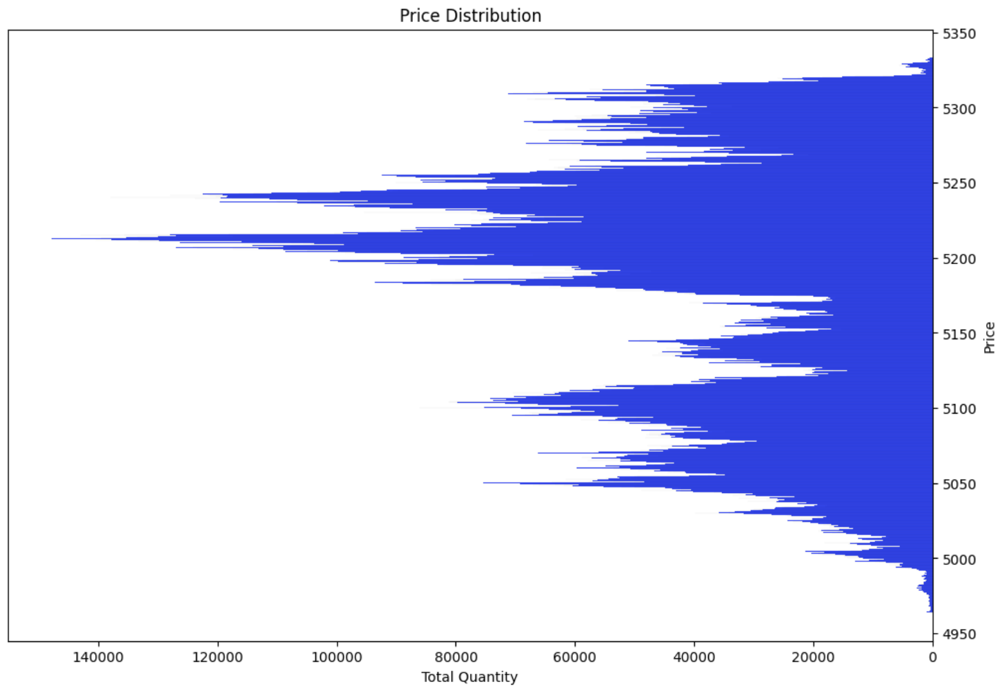

# Sierra Chart Scid to PostgreSQL

## Overview

This project reads Sierra Chart SCID files and writes the data to a PostgreSQL database. The data includes timestamp, price, quantity, and market side (bid/ask).

## Prerequisites

1. Python 3.8+
2. PostgreSQL 12+
3. Required Python libraries:
   - `asyncpg`
   - `polars`
   - `numpy`
   - `pandas`
   - `pytz`


You can install the required libraries using pip:
```bash
pip install asyncpg polars numpy pandas pytz
```

## PostgreSQL Setup

Ensure you have a PostgreSQL database available. You will need the following details:

- **Host**: e.g., `localhost`
- **Port**: e.g., `5432`
- **Username**: e.g., `your_username`
- **Password**: e.g., `your_password`
- **Database name**: e.g., `your_database`


## Project Files

1. `db_create.py`
This script sets up the PostgreSQL table to store SCID data. Update the PostgreSQL connection details and the table name in this script.

2. `checkpoint.json`
This file tracks the last processed position in the SCID file and whether the initial load is completed.

3. `data_sync.py`
This script reads the SCID file and updates the PostgreSQL table at regular intervals. Update the table name, SCID file path, and other parameters as needed.

## Usage
### Step 1: Set Up the PostgreSQL Table
1. Update the PostgreSQL connection details and table name in `db_create.py`:

   ```python
   # Update these lines with your PostgreSQL credentials
   host="localhost",
   port="5432", 
   user="your_username",
   password="your_password",
   database="your_database"

   # Default table name is "esm24", but should be modified to match the specific contract symbol you are working with.
   CREATE TABLE IF NOT EXISTS "esm24"
    ```
2. Run `db_create.py` to set up the database table:

    ```bash
    python db_create.py
    ```
### Step 2: Initialize the Checkpoint File
1. Ensure `checkpoint.json` is set up for the initial load. The table name in `checkpoint.json` should match the table name you set in `db_create.py`. For the first run, use the following configuration:

   ```json
   {"esm24": {"last_position": 0, "initial_load_done": false}}
    ```
    Replace "esm24" with your specific table name if it's different.

### Step 3: Start Data Synchronization
1. Update the table name and SCID file path in `data_sync.py`:

   ```python
    table_name = "esm24"  # Specify the unique table name for your data.
    scid_file = "/Volumes/[C] Windows 11/Sierra/Data/ESM24-CME.scid"  # Set the file path to your SCID file.

2. Set the update interval in `data_sync.py` to continuously update data from the SCID file. 
    Here, "1" means pause the execution for 1 second between updates:
    ```python
    while True:
    asyncio.run(main(table_name, scid_file, initial_load=False))
    time.sleep(1)  # Pause for 1 second before the next update. Adjust as needed.
    ```

3. Run `data_sync.py` to start synchronizing data (the initial run may take some time depending on the SCID file size and your system performance etc., please be patient):
    ``` bash
    python data_sync.py
    ```

### Data Validation
To validate the data, use the provided Jupyter Notebook `data_check.ipynb`. This notebook connects to the PostgreSQL database, retrieves data, and performs basic validation checks.

Example Output:

```
min value:  4963.5
max value:  5333.5
min value of quantity:  1
max value of quantity:  2962
min value of side:  0
max value of side:  1
min value of actual_datetime:  2024-02-22 18:07:25.394000-06:00
max value of actual_datetime:  2024-05-10 15:59:59.478001-05:00
total rows count:  43818522
Number of null entries:
 price       0
quantity    0
side        0
dtype: int64
Unique values in 'side':  [1 0]
Distribution of 'price' values:  price
5211.75    95325
5212.50    95262
5211.50    93263
5212.00    90905
5212.75    90141
           ...  
4963.75      173
5330.75      126
5333.25      113
4963.50       34
5333.50        4
Name: count, Length: 1481, dtype: int64
```

Example Plot:

Here is an example plot of the price distribution.


